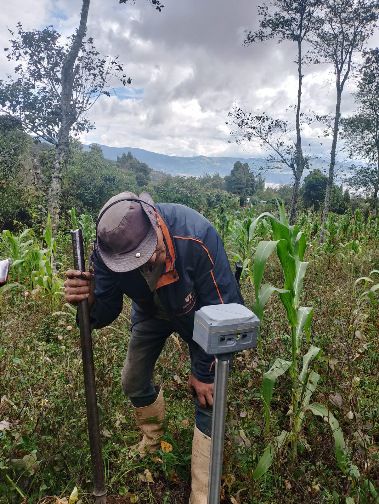
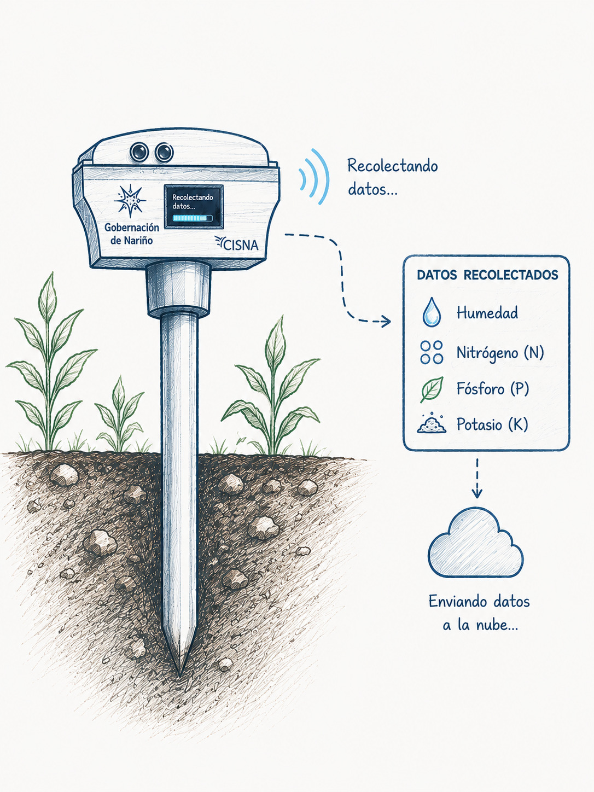
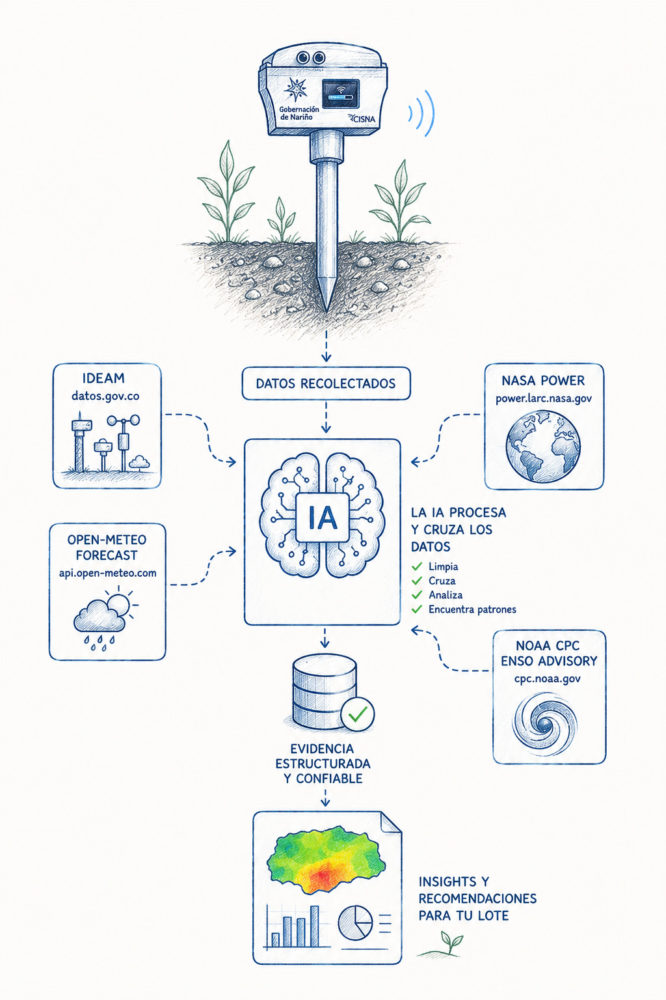
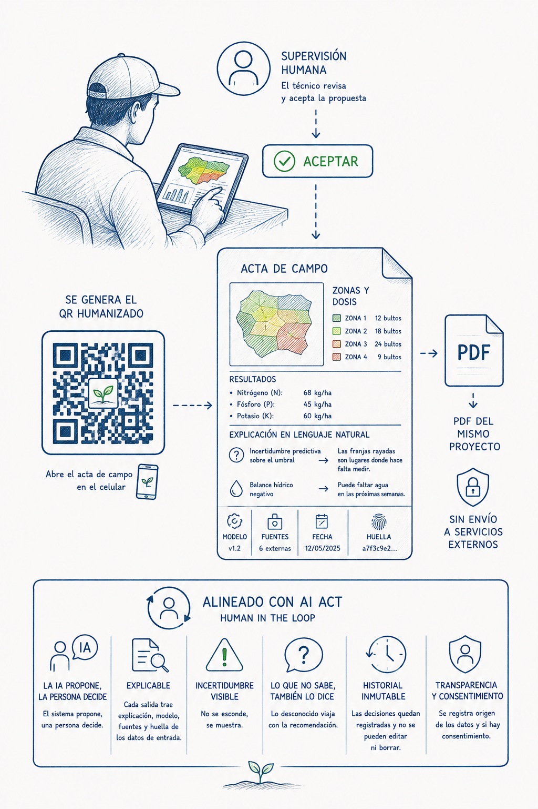
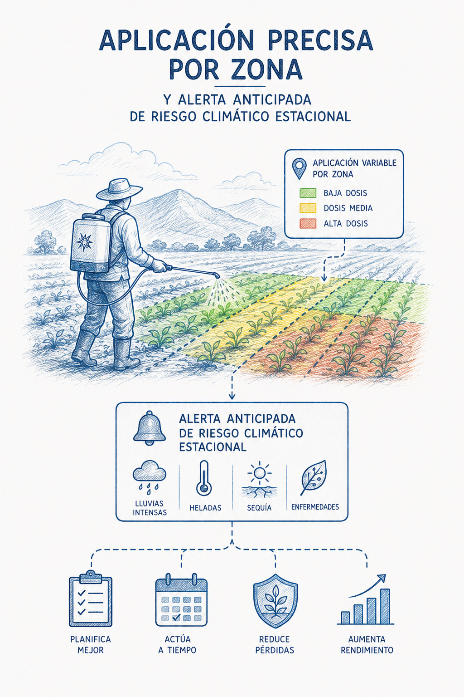

<p align="center">
  
</p>

<p align="center">
  <strong>Un sensor de suelo, muchas fincas.</strong><br>
  Convierte mediciones de nitrógeno, fósforo y potasio (NPK) en un mapa del lote,<br>
  una receta de fertilización <em>recomendada</em> y una decisión que siempre firma una persona.
</p>

<p align="center">
  
  
  
  
  
  
  
</p>

<p align="center">
  
  
  
  
  
  <a href="LICENSE"></a>
</p>

---

## El problema

Un centro de acopio de papa en Nariño compra a decenas de pequeños productores de
media a dos hectáreas. Ninguno tiene análisis de suelo reciente: el laboratorio
cuesta más de lo que deja una cosecha pequeña y los resultados llegan cuando ya se
sembró. Entonces se fertiliza por costumbre —el mismo bulto, la misma dosis, en
todo el lote y todos los años.

Y un lote no es homogéneo. En las **19 mediciones REALES** de esta demo, dos
puntos separados **45 metros** dan potasio de **1 %** y de **13 %**, y el
nitrógeno va de **1 % a 27 %** dentro de la misma hectárea y cuarto. Fertilizar
eso con una dosis única es equivocarse en casi toda la superficie: sobra donde ya
había, falta donde el suelo estaba pobre, y el excedente de N y P termina lavado
en el río.

Comprar un sensor por finca no lo resuelve, porque nadie lo va a comprar.

## A quién está dirigido

IOmido está pensado para **centros de acopio, asociaciones y técnicos
agropecuarios que acompañan a pequeños productores**. El centro comparte un
sensor entre muchas fincas, interpreta las mediciones y entrega al agricultor una
propuesta que puede entender y discutir. El productor no necesita comprar
hardware, aprender un software especializado ni tener conexión permanente.

## Impacto social

El proyecto busca que la agricultura de precisión deje de ser un servicio
reservado para fincas grandes. Compartir el sensor reduce la barrera de entrada;
aplicar por zonas **puede** evitar fertilizante innecesario y busca disminuir el
excedente de N y P que termina en las fuentes de agua; mostrar la incertidumbre
evita disfrazar una estimación como certeza; y traducir el resultado a lenguaje
cotidiano devuelve la decisión a quien conoce el lote.

IOmido no reemplaza al agricultor, al técnico ni al laboratorio. Les da una
evidencia más útil, trazable y oportuna para decidir juntos.

---

## De la tierra a la decisión

### ① La medición en campo



El técnico del centro de acopio recorre las fincas con **un solo sensor
compartido por toda la red**. Lo clava en la tierra y anota N, P, K y la
coordenada. Nada más. El productor no compra hardware, no instala software y no
paga suscripción.

Así se levantaron las 19 lecturas del lote **El Rosal** (papa Diacol Capiro,
1,28 ha, Pasto, Nariño) sobre las que corre todo lo que sigue. No son datos
generados.

### ② Recolección y envío a la nube



Cada lectura lleva un identificador único. Si el técnico pierde señal y vuelve a
enviarla, el sistema la reconoce y **no la duplica**. También se pueden cargar
varias mediciones a la vez desde un archivo de Excel.

La lectura fuera del polígono no se borra: se **conserva y se anota**. De las 19,
18 entran al modelo y una queda marcada por geometría, con su motivo. Un dato mal
ubicado que desaparece en silencio es un dato que nadie puede auditar después.

### ③ El sistema le suma el clima



Saber qué tiene el suelo no basta: también importa qué clima viene. El sistema
consulta seis fuentes abiertas y las junta con la lectura del sensor.

| Fuente | Qué aporta |
|---|---|
| **IDEAM** | El clima **medido** por una estación colombiana real. La de El Rosal está a 2,47 km. |
| **Open-Meteo** | El pronóstico de 16 días para el punto exacto del lote, no para el pueblo. |
| **NASA POWER** | 20 años de historia del mismo punto, para saber si esta temporada es rara. |
| **NOAA** | Si estamos en El Niño o La Niña. |
| **Anthropic Claude** | Escribe las explicaciones en español claro. No calcula ni decide. |
| **OpenStreetMap** | El mapa de fondo. Si no carga, todo lo demás se sigue viendo. |

Los datos públicos llegan sucios: el IDEAM repite la misma lectura hasta 19
veces, y sumarlas sin revisar inflaba la lluvia un 31 %. El sistema quita esas
copias y avisa cuántas quitó.

Si una fuente falla o no hay Internet, sigue funcionando con la última copia
guardada **y lo dice en pantalla**.

### ④ Sale un mapa y una receta que se entiende



Con 18 mediciones el sistema arma un mapa del lote celda por celda. No solo dice
qué hay en cada punto: también **dónde no está seguro**. Las franjas rayadas
significan «aquí falta medir», no «aquí el suelo es pobre». Y le indica al
técnico dónde conviene tomar la próxima muestra.

Después prueba las 12 341 mezclas posibles con los bultos que hay en la bodega
del centro y devuelve la que mejor cubre lo que necesita cada zona:

```text
Zona 1 · 0,67 ha        8 bultos de 20-10-30  +  1 bulto de 30-30-40
                        faltante 0,0 kg  ·  exceso 48,9 kg
```

Bultos enteros, porque nadie aplica 2,7 bultos. Sin marcas y **sin precios**: el
objetivo es nutricional, y no publicamos un ahorro que no podemos sustentar.

La receta se propone, no se ordena: nace pendiente de validación y una persona la
**acepta, la cambia, la rechaza o la remite** a otro profesional. Cuando alguien
la acepta, el tablero genera un **QR** que abre el acta de campo en el celular,
con cada tecnicismo traducido al lado. El QR se arma dentro de la aplicación y no
manda datos a ningún servicio externo.

Claude redacta esas explicaciones, pero no inventa: un verificador compara cada
cifra que escribe contra las cifras permitidas y, si aparece un número que no
estaba en los datos, descarta la respuesta entera.

### ⑤ Aplicación precisa y anticipación al clima



La receta llega a la zona que la necesita, en la cantidad que le corresponde, y
**en el momento en que tiene sentido aplicarla**. Tres motores de riesgo
explicables acompañan cada propuesta:

- **Helada** — mínima prevista por Open-Meteo, agravada por fase ENSO seca.
- **Sequía** — balance hídrico lluvia − evapotranspiración, más la anomalía
  estacional y El Niño. Es la misma señal que precede a una temporada seca
  crítica en el altiplano nariñense.
- **Gota tardía** (*Phytophthora infestans*) — horas favorables en las próximas
  48 h. Es lo que arruina un cultivo de papa en el alto andino.

Cada riesgo explica su nivel, cuándo podría ocurrir, qué datos y fuentes utilizó
y **qué cambió en la propuesta**. Si alguna fuente falla o está desactualizada,
la confianza baja automáticamente de 0,90 a 0,65 y se informa.

Son **reglas transparentes con límites visibles**, no un modelo entrenado con
ejemplos inventados para presumir una precisión que no existe.

> Hasta aquí, el recorrido completo sin tecnicismos. ¿Quieres ver cómo funciona
> por dentro —los modelos, las fórmulas y cada llamada a las APIs? Está todo en
> **[TECNICO.md](TECNICO.md)**.

---

## La demo en un minuto

Centro de acopio demo con tres formulaciones en bodega: `30-30-40`, `20-10-30` y
`10-20-20`. La aplicación abre en un centro de control con barra lateral y nueve
secciones; el recorrido de la demo toca seis:

1. **Resumen** — qué lotes necesitan medición o revisión, hoy.
2. **Mapas** — N, P y K en porcentaje; lo rayado es lo incierto, no lo pobre.
3. **Recomendaciones** — `20-10-30 × 8 + 30-30-40 × 1` por zona, con su faltante
   y su exceso.
4. **¿Por qué?** — modelo, entradas, fuentes, hash de los datos y lo que **no**
   se sabe.
5. **Alertas** — el riesgo climático con su ventana, su confianza y su efecto
   sobre la propuesta.
6. **Historial** — se acepta o se remite, y queda en un registro que no se puede
   alterar.

## Correrlo (para desarrolladores)

```powershell
python -m pip install -r backend/requirements.txt
python -m uvicorn app.main:app --reload --port 8000    # desde backend/
```

En otra terminal:

```powershell
cd frontend
python -m http.server 5173
```

Abrir <http://localhost:5173>. El primer arranque crea la base, carga la
configuración versionada e importa las 19 mediciones solo: no hay paso manual.
Sin backend la aplicación abre igual contra el mock; sin Internet el backend
funciona igual y lo declara.

```powershell
python -m pytest backend/tests -q        # 66 pruebas, ninguna toca la red
python backend/scripts/demo_backend.py   # el proceso entero sin Internet
```

## Lo que afirmamos y lo que no

Cualquiera puede verificar esto en el código, no solo leerlo aquí.

**Sí:**

- El proceso completo usa mediciones reales de un lote real.
- Construye el mapa, muestra sus dudas y recomienda la siguiente medición.
- Encuentra la mejor mezcla posible dentro de sus límites y lo demuestra
  (`optimal_within_bounds: true`, 12 341 combinaciones enumeradas).
- Los riesgos modifican la propuesta con explicación y fuente.
- Toda decisión queda en un registro que la base impide reescribir.

**No, y lo decimos en la propia respuesta del sistema:**

- El sensor **todavía no se ha comparado con análisis de laboratorio**. Cada
  respuesta incluye esta advertencia.
- Los valores agronómicos de la demo son supuestos sin validar, no una
  prescripción firmada por un agrónomo.
- **El modelo actual no fue más preciso que el método sencillo usado como
  comparación.** Se mantiene porque permite mostrar la incertidumbre y sugerir
  dónde medir después, no porque haya demostrado mayor precisión.
- Los riesgos modelados son **helada, sequía y gota tardía**, además del contexto
  de El Niño o La Niña. **No modelamos incendios**: la señal de sequía indica
  condiciones propicias, y eso es todo lo que podemos afirmar.
- No estimamos ahorro en pesos, no predecimos rendimiento y no puntuamos
  agricultores.

Preferimos un sistema que sepa lo que no sabe.

## Uso responsable, AI Act y escalabilidad

El [AI Act de la Unión Europea](https://eur-lex.europa.eu/eli/reg/2024/1689/oj)
establece un enfoque basado en el riesgo y, para determinados sistemas de alto
riesgo, exige supervisión humana efectiva. IOmido adopta esos principios como
guía de diseño. Esto **no equivale a afirmar una certificación o clasificación
legal** del proyecto.

- **Una persona decide.** La IA prepara el mapa y recomienda una receta, pero el
  técnico o agrónomo puede aceptarla, modificarla, rechazarla o remitirla. Nada
  se presenta como aplicado sin esa decisión, y la propia base de datos impide
  guardarlo de otra manera.
- **Todo queda explicado y trazable.** Cada resultado viaja con su explicación,
  su modelo, sus fuentes y una huella digital de los datos de entrada que permite
  comprobar que nadie los cambió. Las decisiones quedan en un historial que no se
  puede editar ni borrar.
- **Las dudas se muestran, no se maquillan.** Lo que el sistema no sabe llega en
  la misma respuesta que la recomendación.
- **Los datos tienen dueño.** Se registra de dónde viene cada dato y si hay
  consentimiento para usarlo. No puntuamos agricultores ni evaluamos crédito.
- **Escalar no significa quitar a la persona.** Un sensor compartido y el mismo
  motor pueden atender muchas fincas. La validación ocurre por lote, en el punto
  importante: antes de llevar la recomendación al campo.
- **Cada región conserva control local.** Antes de incorporar un cultivo o una
  zona nueva, deben validarse los parámetros con especialistas locales, definirse
  responsables y vigilar si la calidad del sistema cambia con el tiempo.

Así, crecer significa producir más recomendaciones trazables y revisables, no
automatizar más decisiones sin control.

## Documentación

| Documento | Qué encontrarás |
|---|---|
| [TECNICO.md](TECNICO.md) | Stack, arquitectura, cada modelo, cada API externa, **cómo se usa la IA** y por qué esto no se podía construir hace dos años |
| [MODEL_CARD.md](MODEL_CARD.md) | Métricas reproducibles, usos permitidos y prohibidos, riesgos |
| [docs/API.md](docs/API.md) | Catálogo de los 35 endpoints y códigos de error |
| [backend/README.md](backend/README.md) | Operar el backend |
| [frontend/README.md](frontend/README.md) | Operar el frontend |

## Antes de que esto llegue a un lote de verdad

1. Calibrar el sensor contra muestras de laboratorio.
2. Medir la densidad aparente real y validar la profundidad de muestreo.
3. Que un ingeniero agrónomo local firme requerimientos, disponibilidad y
   máximos por cultivo, variedad y etapa.
4. Consultar clima en vivo en vez de los datos de respaldo incluidos en la demo.
5. Cargar el inventario real de formulaciones de cada centro.
6. Hacer pruebas con más lotes y temporadas, y volver a comparar el modelo con
   métodos más sencillos.

Ninguno de esos pendientes autoriza presentar el perfil de demo como una
prescripción validada. Por eso, el sistema marca toda propuesta como pendiente
de validación técnica.

## Licencia

Código bajo [licencia MIT](LICENSE): cualquiera puede usarlo, modificarlo y
distribuirlo, incluso comercialmente, siempre que conserve el aviso de autoría.
Se entrega **sin garantía**, y eso importa aquí más que en otros proyectos: nada
de lo que produce este sistema es una prescripción agronómica validada.

## El equipo

<p align="center">
  <a href="https://www.linkedin.com/in/david-morales-galindo-35042b319/"></a>
  <a href="https://www.linkedin.com/in/luis-alejandro/"></a>
  <a href="https://www.linkedin.com/in/german-m-r-26aa08136/"></a>
</p>
